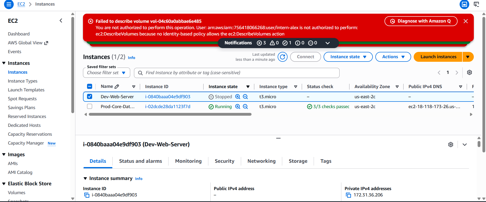
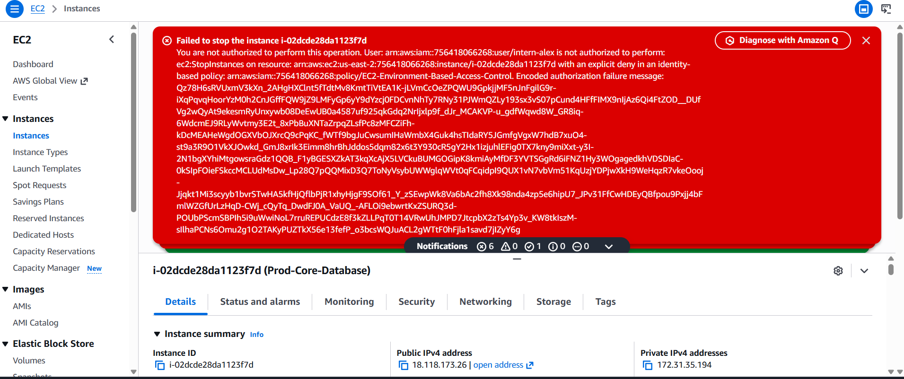

# Automated Cloud Governance & Least-Privilege IAM Hardening

## 📋 Executive Summary

* **Objective:** Secure a multi-tier AWS environment by implementing strict access controls for a third-party contractor/intern workstream.
* **The Business Problem:** Unrestricted access to infrastructure introduces massive operational risks, potential data breaches, and non-compliance with standard security frameworks (e.g., SOC 2, ISO 27001). The business required that external personnel manage development resources without any capability to view, alter, or disrupt production assets.
* **The Solution:** Engineered an **Attribute-Based Access Control (ABAC)** matrix utilizing custom AWS IAM JSON policies. This setup automatically grants or denies operational capabilities based on real-time resource tagging frameworks, successfully enforcing the **Principle of Least Privilege**.

---

## 🏗️ Architecture & Control Design

### 1. Asset Management Framework (Tagging Strategy)

To maintain strict configuration compliance, an asset classification standard was enforced across all compute resources using a binary lifecycle tag:

* **Development Assets:** `Key: Environment` | `Value: Development`
* **Production Assets:** `Key: Environment` | `Value: Production`

### 2. Identity & Access Governance

Instead of managing permissions at the individual user level (which creates configuration drift), identity lifecycle management best practices were applied:

* Created an isolated IAM User Group: `DevOps-Intern-Group`
* Enforced structural security baseline settings (MFA requirement notation, strict password complexity).
* Onboarded a simulated testing identity (`intern-alex`) directly to the restricted group profile.

---

## 🛠️ Technical Implementation (The Code)

The following custom IAM JSON policy was engineered and attached to the group level. It establishes a read-only console baseline, applies conditional execution on approved assets, and locks down high-risk actions on production assets via an **Explicit Deny**:

```json
{
    "Version": "2012-10-17",
    "Statement": [
        {
            "Sid": "AllowVisualConsoleListing",
            "Effect": "Allow",
            "Action": [
                "ec2:DescribeInstances",
                "ec2:DescribeTags",
                "ec2:DescribeInstanceStatus"
            ],
            "Resource": "*"
        },
        {
            "Sid": "AllowStateManagementForDevOnly",
            "Effect": "Allow",
            "Action": [
                "ec2:StartInstances",
                "ec2:StopInstances",
                "ec2:RebootInstances"
            ],
            "Resource": "arn:aws:ec2:*:*:instance/*",
            "Condition": {
                "StringEquals": {
                    "aws:ResourceTag/Environment": "Development"
                }
            }
        },
        {
            "Sid": "ExplicitDenyForProd",
            "Effect": "Deny",
            "Action": [
                "ec2:StartInstances",
                "ec2:StopInstances",
                "ec2:RebootInstances",
                "ec2:TerminateInstances"
            ],
            "Resource": "arn:aws:ec2:*:*:instance/*",
            "Condition": {
                "StringEquals": {
                    "aws:ResourceTag/Environment": "Production"
                }
            }
        }
    ]
}

```

---

## 🧪 Security Testing & Audit Verification

To validate that the technical controls mapped accurately to the business compliance requirements, a formal security audit simulation was executed using an isolated incognito session under the restricted `intern-alex` credentials:

### Test Case 1: Authorized Action on Development Environment

* **Action:** Attempted to execute a `StopInstance` command on `Dev-Web-Server` (`Environment: Development`).
* **Result:** **SUCCESS.** The instance state transitioned smoothly. This verified that operational velocity remains unhindered for approved day-to-day tasks.
* 


### Test Case 2: Unauthorized Breach Attempt on Production Environment

* **Action:** Attempted to execute a `StopInstance` command on `Prod-Core-Database` (`Environment: Production`).
* **Result:** **BLOCKED (EXPLICIT DENY).** The AWS API instantly dropped the request and threw a critical authorization error banner: *"You are not authorized to perform this operation."*
* 


---

## 🎯 Key GRC Framework Alignments

By building and deploying this configuration, the architecture successfully aligns with the following industry compliance standards:

* **NIST SP 800-53 (AC-6 - Least Privilege):** Enforced user permissions restricted strictly to the minimum necessary functions to perform standard job duties.
* **ISO/IEC 27001 (A.8.1 - Asset Management):** Utilized system tagging arrays to create an enforceable, trackable inventory control baseline.

---

